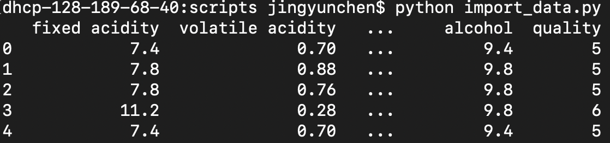
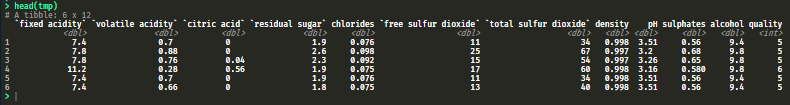

# Red Wine Quality Predictor

## Team members

| Name  | Github username | 
| :------: | :----------: |
| Jingyun Chen | jchen9314 |  
| Anthony Chiodo |apchiodo|

## Data set
The data set we work on is [Red Wine Quality](https://www.kaggle.com/uciml/red-wine-quality-cortez-et-al-2009) from [Kaggle Dataset](https://www.kaggle.com/datasets).This data set is related to red variants of the Portuguese "Vinho Verde" wine.

### Proof we can load data

**Python**

**R**

The scripts for loading data can be found [here](https://github.com/UBC-MDS/DSCI_522_jchen9314_apchiodo/tree/master/scripts).

## Question
The question we want to solve is: 

**Which physiochemical characteristics of wine are the strongest predictors of wine quality?**

This is a predictive question.

## Plan of analysis
We will firstly get familiar with data set by performing some exploratory data analysis. Then, we will split data set into training and test sets. Also, we will separate features of interest from target. We will then apply decision tree classification to the training set using `scikit-learn` and play with some hyperparameters. Finally, we will evaluate how our model performed on the test set and tease out the most important physiochemical characteristics for classifying a good wine.

## Summarize the data

The output of the machine learning excercise will give us feature importance in determining wine quality, which we can show in tabular form. To visualize, we can create an ordered bar chart of each feature.

