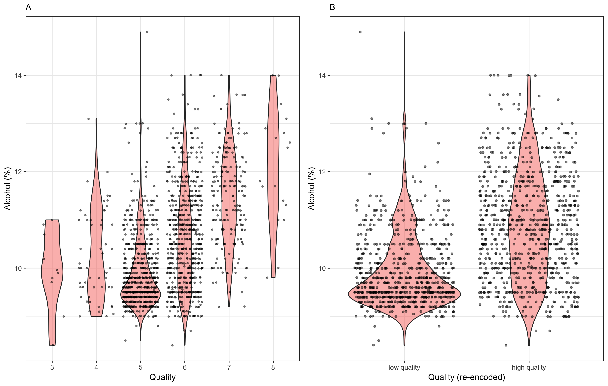
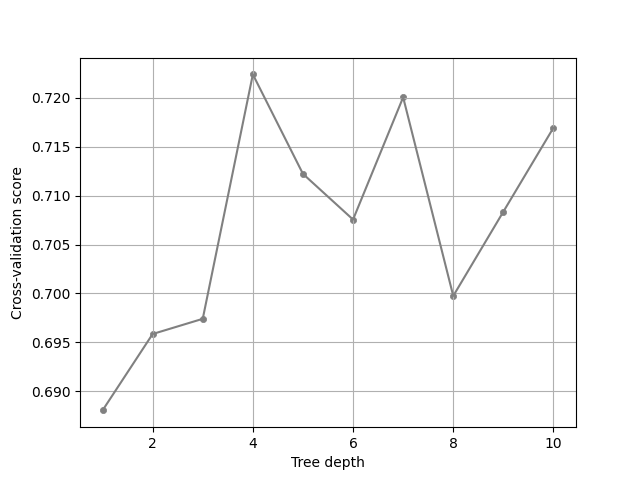
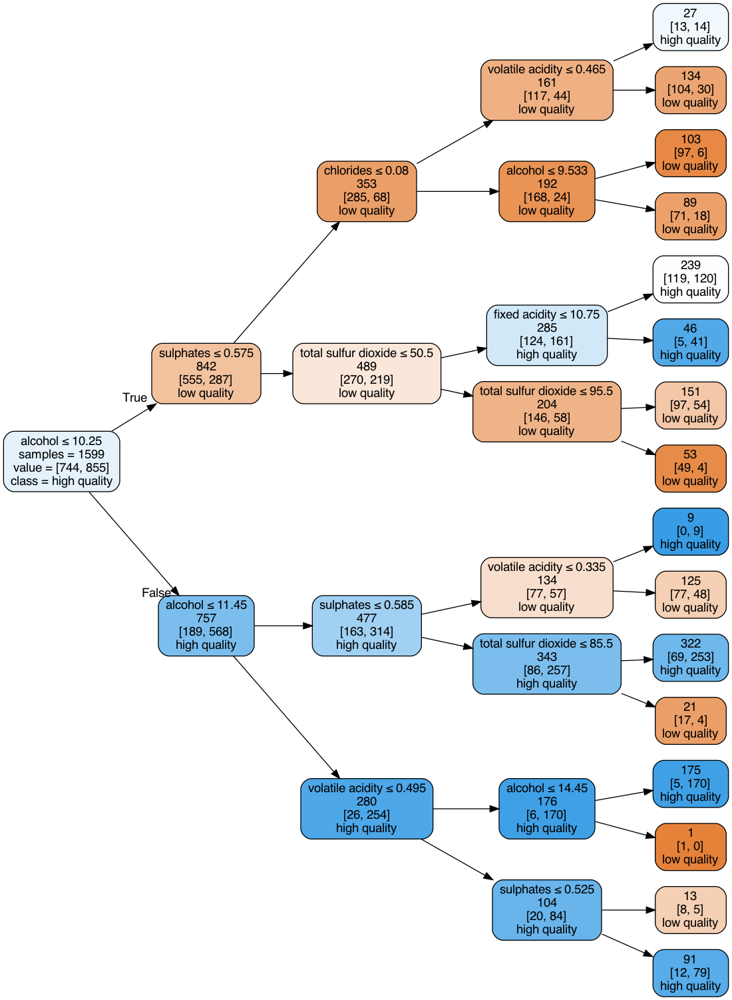

```{r setup, include=FALSE}
knitr::opts_chunk$set(echo = TRUE)
```

```{r libraries, include=FALSE}
library(dplyr)
```

### Introduction 

Have you ever attended a dinner party and felt completely clueless when the conversation topic abruptly shifts to the quality of the wine paired with your meal?  If so, then you are not alone. Often, the arbitrary labeling of a given wine (i.e. “good” or “bad”) appears to be subject to an everyday consumers palette. And this is OK. It seems that intuitively, an individual should just simply drink the wine that best pleases their own unique taste. However, given the complexity of the wine industry and the degree of professionalism associated with it (wine experts, sommeliers), there clearly must be some characteristics that serve as strong predictors for what ultimately is defined as a quality wine.

The purpose of this analysis is to determine which physiochemical characteristics of red wine are the most important predictors of wine quality.


### Data set

The data set we use to conduct this analysis was downloaded from Kaggle, but originally existed as a data set available through the UCI Machine Learning repository (Cortez et. al 2009). It contains 1599 red variants of the Portuguese Vinho Verde wine. The physiochemical characteristics are captured in 11 numeric features (Table 1), and the categorical target output exists as a ranking between 0 and 10 (although, the dataset itself only includes ranks ranging from 3 to 8). The target outputs were determined as the median rank and were assessed by wine experts.

```{r dataDescription, echo=FALSE}

tmp <- tibble::tribble(

  ~feature, ~description,
  "fixed acidity", "most acids involved with wine or fixed or non-volatile (do not evaporate readily)",
  "volatile acidity", "the amount of acetic acid in wine, which at too high of levels can lead to an unpleasant, vinegar taste",
  "citric acid", "found in small quantities, citric acid can add 'freshness' and flavor to wines",
  "residual sugar", "the amount of sugar remaining after fermentation stops, it's rare to find wines with less than 1 gram/liter and wines with greater than 45 grams/liter are   considered sweet",
  "chlorides", "the amount of salt in the wine",
  "free sulfur dioxide", "the free form of SO2 exists in equilibrium between molecular SO2 (as a dissolved gas) and bisulfite ion; it prevents microbial growth and the oxidation of wine",
  "total sulfur dioxide", "amount of free and bound forms of S02; in low concentrations, SO2 is mostly undetectable in wine, but at free SO2 concentrations over 50 ppm, SO2 becomes evident in the nose and taste of wine",
  "density", "the density of water is close to that of water depending on the percent alcohol and sugar content",
  "pH", "describes how acidic or basic a wine is on a scale from 0 (very acidic) to 14 (very basic); most wines are between 3-4 on the pH scale",
  "sulphates", "a wine additive which can contribute to sulfur dioxide gas (S02) levels, which acts as an antimicrobial and antioxidant",
  "alcohol", "the percent alcohol content of the wine"
)


knitr::kable(tmp)

```

**Table 1:** A description of the 11 physiochemical characteristics used as features to predict wine quality. Descriptions provided by [UCI Machine Learning](https://www.kaggle.com/uciml/red-wine-quality-cortez-et-al-2009).

Exploratory data analysis revealed that the distribution of the data across the targets was fairly unbalanced (i.e. many wines were ranked as 5 or 6, and few wines were ranked below 5 or above 6). Since the ranking scale is from 0 to 10 and most of the data existed at ranks 5 and 6, we re-encoded the data such that targets less than or equal to 5 were classified as 0  (or “poor” quality), and targets greater than 5 were classified as 1 (or “good” quality). By converting this to a binary classification problem, the data became more evenly balanced between classes.

**Figure 1:** A visual representation of the data associated with each class in the original dataset (A), and the re-encoded dataset (B).

```{r, out.width = "700px", echo=FALSE, fig.align='center'}

```

### Prediction approach

In order to address our primary question, we chose to use a decision tree model. All of the methods were inherited from `scikit-learn`, which is a machine learning package for the python environment. The process of conducting a decision tree classification is as follows:

1. Separate data into features (11 physiochemical characteristics) and target (wine quality)
2. Split the data into train (80%) and test (20%) sets
3. Perform 5-fold cross-validation on the train set to determine the best max depth to use in decision tree model
4. Train decision tree model on training data with best max depth as determined from cross-validation
5. Predict targets on test data and compute the test accuracy

### Result

After running 5-fold cross-validation on the train set, we picked the depth of 11 as our final tuned hyper-parameter for the model because it has the highest cross validation score, which is shown in Figure 2. 

**Figure 2:** The results of cross-validation against maximum tree depth

```{r, out.width = "700px", echo=FALSE, fig.align='center'}
 
```

Figure 3 shows a decision tree model we used in this project.

**Figure 3:** The decision tree model visualization

```{r, out.width = "700px", echo=FALSE, fig.align='center'}
 
```


Table 2 shows the classifier and hyperparameter that we used, the accuracy of both the train and test set. The final classification accuracy of the train and test set are around 0.722 and 0.753, respectively.

```{r, echo=FALSE, warning=FALSE, message=FALSE}

tmp <- readr::read_csv('../results/pred_summary_table.csv') %>% 
  select("Classifier","Best depth", "Train accuracy", "Test accuracy")
knitr::kable(tmp)

```

**Table 2:** Prediction summary

Table 3 shows the importance of each feature for classifying the wine quality. Features that have zero importance are not shown in the table. The three most important features according to our results are alcohol, sulphates, and total sulfur dioxide with an importance of about 0.553, 0.208, and 0.108, respectively.

**Table 3:** A table showing feature importance as determined by our decision tree classification.

```{r, echo=FALSE, warning=FALSE, message=FALSE}

tmp <- readr::read_csv('../results/feature_importance.csv') %>% 
  select(-X1)

knitr::kable(head(tmp))

```

### Discussion

**To do: Discussion on tree model**

The classification accuracy is around 0.712, which is not a bad result---but is also not a great result. Intuitively, this means that about 71% of the time, we are able to correctly predict the quality of the wine based on its physiochemical characteristics. 

In this project, we only tuned one hyperparameter in our decision tree model, which was the maximum depth. This certainly exists as a limitation of our analysis. Perhaps if we explored the use of other hyperparameters (ex. `min_samples_leaf`, `max_features`, or `criterion` from scikit-learn), we would be able to achieve higher classification accuracy.  Furthermore, a more robust analysis might include not only an examination of additional hyper-parameters but also a comparison of how alternative models score. For example, we could have used other machine learning algorithms, such as random forest or KNN and evaluated their test accuracy in comparison to our decision tree model.

As mentioned, alcohol, volatile acidity, and sulphates were the most important features in determining whether a wine was of poor or good quality. This means that next time you are at a dinner party, you can likely stun your ordinary wine consuming audience with a statement somewhere along the lines of "This wine has the most wonderful composition of alcohol, sulphates, and total sulfur dioxide"...(OK, maybe that's a stretch and no one will buy it...but it's worth a shot!)

### Future Work

A limitation of this model is that the dataset only contains information on a specific type of Portuguese red wine, Vinho Verde. This means that our model is not appropriate to test the quality of different types of red wine (ex. Merlot, Cabernet Sauvignon, etc.). If we were to collect similar data on different types of wine, perhaps we would be able to tease out which physiochemical characteristics are most important in determining red wine quality, regardless of its type (thus, generalizing our model).

### Reference

1. Red wine quality dataset: https://archive.ics.uci.edu/ml/machine-learning-databases/wine-quality/
    - *P. Cortez, A. Cerdeira, F. Almeida, T. Matos and J. Reis. 
  Modeling wine preferences by data mining from physicochemical properties.
  In Decision Support Systems, Elsevier, 47(4):547-553. ISSN: 0167-9236.*
2. Scikit-learn decision tree package: https://scikit-learn.org/stable/modules/tree.html
    - *Scikit-learn: Machine Learning in Python, Pedregosa et al., JMLR 12, pp. 2825-2830, 2011.*
